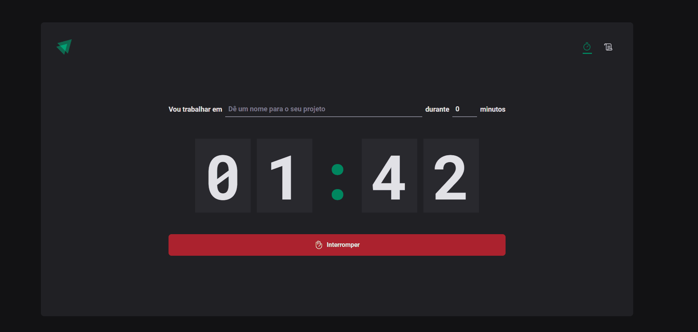

# Ignite Timer Rocketseat

## Tabela do Conteudo

<ul>
<li><a href="#como-usar">Como usar</a></li>
<li><a href="#sobre">Sobre</a></li>
<li><a href="#status">Status</a></li>
<li><a href="#objetivo">Objetivo</a></li>
<li><a href="#curiosidade">Curiosidade</a></li>
<li><a href="#tenologias">Tecnologias utilizadas no projeto</a></li>
<li><a href="#acessando-o-site">Acessando o site do projeto</a></li>
</ul>

## Como usar

Para rodar o projeto em sua máquina você deve seguir os passos abaixo:

git clone https://github.com/Lucaszanin/ignite-timer.git

cd ignite-timer 

npm i 

npm run dev 

## Sobre

O Projeto foi proposto como projeto trilha de React do curso Ignite da Rocketseat.

Nesse desafio, foi desenvolvido uma aplicação para controle de timer, com base no metodo **pomodoro** que serve para melhorarmos nossa gestão do tempo. Caso queira conhecer um pouco mais sobre o método pomodoro <a href="https://www.napratica.org.br/pomodoro/">Clique aqui!</a>. Esta aplicação conta com as seguintes funcionalidades.

- Adicionar o nome da tarefa em que vamos trabalhar
- Adicionar o tempo entre 5 e 60 minutos
- Pausar o Timer
- Acompanhar listagem de timers e status

## Status

Projeto Ignite Timer concluído 🎯

## Objetivo

A aplicação dos conhecimentos como rotas,imutabiliade,hooks como useEffect, useReducer, useContex e suas aplicações, system desining, Typescript, Styled Components, além do uso das bibliotecas Date-fns,Immer,react-hook-form e zod. E também como salvar informações da melhor forma no localStorage.

Alguns conceitos utilizados no projeto:

Contextos;
Rotas;
Componentes estilizados;
Formulários;
Hook de efeito;
Reducers;

## Tecnologias utilizadas no projeto

<ul>
<li>React</li>
<li>Styled Components</li>
<li>GIT</li>
<li>Typescript</li>
<li>Vite</li>
<li>Phosphor Icons</li>
<li>Immer</li>
<li>React Router Dom</li>
<li>React Hook Form</li>
<li>Vercel ( Para hospedagem do projeto)</li>
</ul>

## Acessando o site do projeto

Para acessar o site do projeto Ignite Timer, por favor use este link : <a href="https://react-pomodoroapp-phbz8xfdy-lucaszanin.vercel.app/" target="_blank"> Ignite Timer</a>
